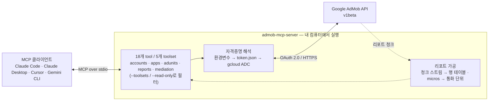
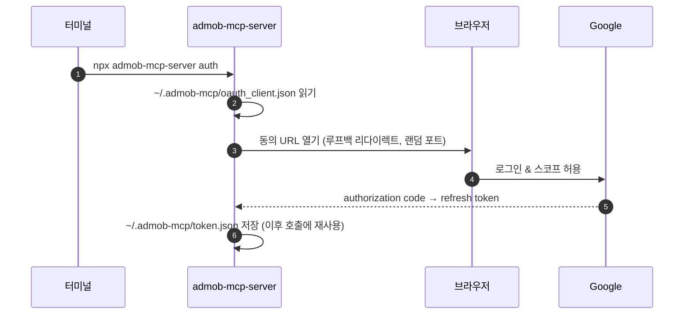

# AdMob MCP Server

[](https://www.npmjs.com/package/admob-mcp-server)
[](https://github.com/ParkSangGwon/admob-mcp-server/actions/workflows/ci.yml)
[](LICENSE)

[English](README.md) | **한국어**

AI 어시스턴트에게 내 AdMob 앱과 수익을 일상 언어로 물어보세요:

> - "지난 7일 동안 내 앱들이 나라별로 얼마나 벌었어?"
> - "이번 달 eCPM이 가장 좋은 미디에이션 광고 소스는 어디야?"
> - "배너 광고랑 보상형 광고의 RPM을 비교해줘."
> - "새 게임에 쓸 보상형 광고 단위를 만들어줘."


[Google AdMob API](https://developers.google.com/admob/api?hl=ko)를 위한 [Model Context Protocol (MCP)](https://modelcontextprotocol.io) 서버입니다.\
Claude Code, Claude Desktop, Cursor, Gemini CLI 등 MCP를 지원하는 모든 AI 클라이언트에서 사용할 수 있습니다.

## 아키텍처



자격증명과 수익 데이터는 내 컴퓨터와 Google 사이에서만 오갑니다 — 중간에 제3자 서버는 없습니다.

## 특징

- **AdMob API v1beta 전체 커버리지** — 계정·앱·광고 단위·리포트·미디에이션에 걸친 18개 tool, v1 API에는 없는 쓰기 기능 포함
- **읽기 좋은 리포트** — 스트리밍 리포트 응답을 단순한 행 테이블로 변환하고, 화폐 값(micros)을 실제 통화 단위로 환산
- **원하면 읽기 전용 모드** — `--read-only`를 주면 쓰기 tool(생성/수정)이 모두 숨겨지고 수정 불가능한 토큰만 발급됨
- **Toolsets** — 필요한 tool 그룹만 활성화 가능, 예: `--toolsets reports,accounts`
- **3가지 인증 방식** — 원커맨드 브라우저 로그인(`npx admob-mcp-server auth`), 환경변수 refresh token, gcloud Application Default Credentials
- **내장 분석 prompt**와 리포트 스펙 레퍼런스 resource 제공

## 설정 한눈에 보기

최초 1회, 약 10분이면 끝납니다:

| 단계                                                | 하는 일                                        | 위치     |
| --------------------------------------------------- | ---------------------------------------------- | -------- |
| [1. Google Cloud 준비](#1단계--google-cloud-준비)   | 내 데이터에 접근할 개인용 "앱"을 Google에 등록 | 브라우저 |
| [2. 로그인](#2단계--로그인)                         | 명령 하나 실행하고 Google 로그인               | 터미널   |
| [3. AI 클라이언트 연결](#3단계--ai-클라이언트-연결) | 설정 한 줄 추가하고 클라이언트 재시작          | 터미널   |

### 요구 사항

- **Node.js 18 이상** — `node --version`으로 확인, 없으면 [nodejs.org](https://nodejs.org)에서 설치
- [AdMob](https://admob.google.com) 계정과 그 계정을 소유한 Google 계정

## 설정

### 1단계 — Google Cloud 준비

왜 필요할까요?\
AdMob API는 단순 API 키를 지원하지 않고, 내 데이터에 접근하는 모든 프로그램을 "OAuth 앱"으로 등록하도록 요구합니다.\
여기서는 나만 사용할 개인용 앱을 하나 등록합니다.\
무료이고 결제 설정도 필요 없습니다.

1. **Google Cloud 프로젝트 생성(또는 선택)**: [console.cloud.google.com/projectcreate](https://console.cloud.google.com/projectcreate) — 이름은 아무거나, 기존 프로젝트 재사용도 OK.
2. **AdMob API 활성화**: [console.cloud.google.com/apis/library/admob.googleapis.com](https://console.cloud.google.com/apis/library/admob.googleapis.com) → 상단 바에서 내 프로젝트가 선택돼 있는지 확인 → **사용(Enable)**.
3. **OAuth 동의 화면 구성**: [console.cloud.google.com/auth/overview](https://console.cloud.google.com/auth/overview) — 처음 방문하면 짧은 마법사가 열립니다:
   - 앱 이름: 아무거나 (예: `admob-mcp`), 지원/연락처 이메일에 본인 이메일
   - 대상(Audience): **외부(External)**
   - 마법사를 완료하세요 — Google 심사에 제출할 필요는 **없습니다**
   - 이어서 **대상 → 테스트 사용자 → Add users**에서 **AdMob 계정을 소유한 Google 계정**을 추가
4. **OAuth 클라이언트 생성**: [console.cloud.google.com/apis/credentials](https://console.cloud.google.com/apis/credentials) → **사용자 인증 정보 만들기 → OAuth 클라이언트 ID**
   - 애플리케이션 유형: **데스크톱 앱(Desktop app)**
   - 생성 후 **JSON 다운로드** 클릭 — 이 파일을 2단계에서 사용합니다

> [!WARNING]
> 동의 화면이 **테스트(Testing)** 상태인 동안에는 로그인이 **7일** 후 만료되어 매주 다시 로그인해야 합니다.\
> 이게 번거로우면 앱을 게시하세요(**대상 → 앱 게시**).\
> 본인만 사용할 경우 Google 심사는 필요 없고, 로그인할 때 "확인되지 않은 앱" 경고만 표시되는데 정상입니다.

### 2단계 — 로그인

다운로드한 JSON 파일을 서버가 찾는 위치로 옮기고, 로그인 명령을 실행합니다:

```bash
mkdir -p ~/.admob-mcp
mv ~/Downloads/client_secret_*.json ~/.admob-mcp/oauth_client.json

npx admob-mcp-server auth
```

(Windows는 탐색기에서 파일을 `C:\Users\<사용자>\.admob-mcp\oauth_client.json`으로 옮긴 뒤 `npx` 명령을 실행하세요.)

브라우저가 열리면 **AdMob 계정을 소유한 Google 계정**을 선택하고 접근을 허용하세요.\
**"Google에서 확인하지 않은 앱"** 경고가 보이면 1단계에서 만든 본인 앱이니 "계속"을 누르면 됩니다.\
터미널에 `Setup complete`가 출력되면 로그인 정보가 `~/.admob-mcp/token.json`에 저장되고 이후 재사용됩니다.

기본 로그인은 쓰기 tool까지 모든 tool을 커버합니다.\
리포트 조회만 필요하면 `npx admob-mcp-server auth --read-only`로 실행하세요.

`auth` 명령이 하는 일:



<details>
<summary><b>고급: 환경변수 (헤드리스 / CI)</b></summary>

refresh token을 이미 갖고 있다면 파일 없이 사용할 수 있습니다 (쓰기 tool을 쓰려면 토큰이 `admob.monetization` 스코프도 포함해야 함):

```bash
export GOOGLE_CLIENT_ID="....apps.googleusercontent.com"
export GOOGLE_CLIENT_SECRET="..."
export GOOGLE_REFRESH_TOKEN="..."
```

</details>

<details>
<summary><b>고급: gcloud Application Default Credentials</b></summary>

Google 공식 Analytics/Ads MCP 서버와 동일한 패턴입니다:

```bash
gcloud auth application-default login \
  --scopes=https://www.googleapis.com/auth/admob.readonly,https://www.googleapis.com/auth/admob.report,https://www.googleapis.com/auth/admob.monetization,https://www.googleapis.com/auth/cloud-platform \
  --client-id-file=path/to/oauth_client.json
```

리포트 조회만 필요하면 `admob.monetization` 스코프는 빼도 됩니다.

</details>

자격증명 적용 우선순위: **환경변수 → `token.json`(`auth`로 생성) → ADC**

### 3단계 — AI 클라이언트 연결

사용하는 클라이언트를 골라 설정하세요.\
MCP 서버는 클라이언트 시작 시점에 로드되므로, 설정을 추가한 뒤 **클라이언트를 재시작**해야 합니다.

**Claude Code**

```bash
claude mcp add admob -- npx -y admob-mcp-server
```

`claude mcp list`로 확인하면 `admob: ... - ✔ Connected`가 보여야 합니다.

**Claude Desktop** — **설정 → 개발자 → 구성 편집**을 열면 `claude_desktop_config.json`이 열립니다 (macOS: `~/Library/Application Support/Claude/`, Windows: `%APPDATA%\Claude\`).\
다음을 추가하세요:

```json
{
  "mcpServers": {
    "admob": {
      "command": "npx",
      "args": ["-y", "admob-mcp-server"]
    }
  }
}
```

앱을 재시작하면 채팅 입력창의 tool 메뉴에 admob이 나타납니다.

**Cursor** — 같은 `mcpServers` 블록을 `~/.cursor/mcp.json`에 추가하고, **Settings → MCP**에서 admob이 활성화됐는지 확인하세요.

**Gemini CLI** — 같은 `mcpServers` 블록을 `~/.gemini/settings.json`에 추가하고, CLI 안에서 `/mcp`로 확인하세요.

> [!TIP]
> 환경변수 로그인을 사용했다면 클라이언트의 `env` 설정으로 변수를 전달하세요 (Claude Code: `--` 앞에 `--env KEY=value` 반복, JSON 설정: `"args"` 옆에 `"env": { ... }` 객체 추가).

## 사용해 보기

tool을 직접 호출할 필요는 없습니다 — 일상 언어로 물어보면 어시스턴트가 알맞은 tool을 알아서 고릅니다.\
시작해볼 만한 질문들:

- _"지난주 내 앱 수익 얼마야?"_
- _"이번 달 수익을 나라별·앱별로 쪼개서 보여줘."_
- _"최근 30일 기준 RPM이 가장 높은 광고 형식은 뭐야?"_
- _"미디에이션 상태 어때? 광고 소스별 observed eCPM 비교해줘."_
- _"내 앱이랑 광고 단위 목록 보여줘."_
- _"게임 앱에 'shop_reward'라는 보상형 광고 단위 만들어줘."_

대부분의 클라이언트는 tool을 실행하기 전에 허락을 물어보므로, 특히 쓰기 작업은 승인 없이 실행되지 않습니다.

## 설정 옵션

모든 설정은 선택 사항입니다 — AdMob 계정이 하나라면 기본값 그대로 동작합니다.

### 환경변수

| 변수                      | 설명                                                                                  | 기본값                                |
| ------------------------- | ------------------------------------------------------------------------------------- | ------------------------------------- |
| `ADMOB_ACCOUNT`           | 퍼블리셔 ID (`pub-XXXXXXXXXXXXXXXX`). 로그인 계정이 여러 계정에 접근 가능할 때만 필요 | 자동 발견                             |
| `ADMOB_TOOLSETS`          | 활성화할 toolset (쉼표 구분)                                                          | 전체                                  |
| `ADMOB_READ_ONLY`         | `true`면 쓰기 tool 제외                                                               | `false`                               |
| `ADMOB_CREDENTIALS_DIR`   | `oauth_client.json` / `token.json` 디렉토리                                           | `~/.admob-mcp`                        |
| `ADMOB_OAUTH_CLIENT_FILE` | `auth`에서 사용할 OAuth 클라이언트 JSON 경로                                          | `<credentials dir>/oauth_client.json` |
| `GOOGLE_CLIENT_ID`        | OAuth 클라이언트 ID (환경변수 로그인; `auth`에서 JSON 파일 대신 사용 가능)            | —                                     |
| `GOOGLE_CLIENT_SECRET`    | OAuth 클라이언트 시크릿 (환경변수 로그인)                                             | —                                     |
| `GOOGLE_REFRESH_TOKEN`    | OAuth refresh token (환경변수 로그인)                                                 | —                                     |

### CLI 플래그

| 플래그                 | 설명                                                   |
| ---------------------- | ------------------------------------------------------ |
| `--toolsets <names>`   | `ADMOB_TOOLSETS`와 동일, 예: `--toolsets reports,apps` |
| `--read-only`          | `ADMOB_READ_ONLY=true`와 동일                          |
| `--account <pub-id>`   | `ADMOB_ACCOUNT`와 동일                                 |
| `--client-file <path>` | `ADMOB_OAUTH_CLIENT_FILE`과 동일 (`auth`용)            |

CLI 플래그가 환경변수보다 우선합니다.\
플래그는 클라이언트 설정의 명령 뒤에 붙입니다.\
예: `npx -y admob-mcp-server --read-only`

## Tools

"tool"은 AI 어시스턴트가 나 대신 호출하는 함수입니다.\
Tool은 5개 toolset으로 그룹화되며, 기본으로 전체가 활성화되고 `--read-only`를 주면 쓰기 tool이 제외됩니다:

| Toolset     | 읽기 tool                                                                            | 쓰기 tool (`--read-only` 시 제외)                                                                                                              |
| ----------- | ------------------------------------------------------------------------------------ | ---------------------------------------------------------------------------------------------------------------------------------------------- |
| `accounts`  | `list_accounts`, `get_account`                                                       | —                                                                                                                                              |
| `apps`      | `list_apps`                                                                          | `create_app`                                                                                                                                   |
| `adunits`   | `list_ad_units`                                                                      | `create_ad_unit`                                                                                                                               |
| `reports`   | `generate_network_report`, `generate_mediation_report`, `generate_campaign_report`   | —                                                                                                                                              |
| `mediation` | `list_ad_sources`, `list_adapters`, `list_mediation_groups`, `list_ad_unit_mappings` | `create_mediation_group`, `update_mediation_group`, `create_ad_unit_mapping`, `create_mediation_ab_experiment`, `stop_mediation_ab_experiment` |

읽기 tool은 `admob.readonly` / `admob.report` 스코프, 쓰기 tool은 `admob.monetization` 스코프(`auth`가 기본으로 요청)가 필요합니다.

### accounts

| Tool            | 설명                                                 |
| --------------- | ---------------------------------------------------- |
| `list_accounts` | 접근 가능한 퍼블리셔 계정 목록 — `pub-...` ID 확인용 |
| `get_account`   | 계정 상세: 퍼블리셔 ID, 리포트 통화, 리포트 시간대   |

### apps

| Tool         | 설명                                                                            |
| ------------ | ------------------------------------------------------------------------------- |
| `list_apps`  | 등록된 앱 목록: 앱 ID, 플랫폼, 스토어 연결·승인 상태                            |
| `create_app` | 앱 생성 — `appStoreId`로 스토어 등록 정보 연결 또는 `displayName`으로 수동 등록 |

### adunits

| Tool             | 설명                                                                                     |
| ---------------- | ---------------------------------------------------------------------------------------- |
| `list_ad_units`  | 광고 단위 목록: ID, 형식, 소속 앱                                                        |
| `create_ad_unit` | 광고 단위 생성 (`appId`, `displayName`, `adFormat`, 선택적 `adTypes` / `rewardSettings`) |

### reports

모든 리포트 tool은 `startDate` / `endDate`(`YYYY-MM-DD`), `metrics`와 선택적 `dimensions`, `dimensionFilters`, `sortConditions`, `maxReportRows`(기본 1000), `currencyCode`를 받습니다.\
응답은 평평한 테이블이며 화폐 지표는 micros에서 통화 단위로 환산됩니다.

| Tool                        | 설명                                                                               |
| --------------------------- | ---------------------------------------------------------------------------------- |
| `generate_network_report`   | AdMob 네트워크 성과: 수익, 노출, 클릭, 매치율, RPM 등                              |
| `generate_mediation_report` | 광고 소스별 미디에이션 성과: `AD_SOURCE` / `MEDIATION_GROUP`별 수익, observed eCPM |
| `generate_campaign_report`  | 교차 홍보 캠페인 통계 (최근 30일만): 노출, 클릭, 설치, 비용                        |

리포트별 유효 dimension/metric은 MCP resource(어시스턴트가 참고할 수 있는 레퍼런스 문서)로 제공됩니다: `admob://reference/network-report-spec`, `mediation-report-spec`, `campaign-report-spec`.

### mediation

| Tool                             | 설명                                                      |
| -------------------------------- | --------------------------------------------------------- |
| `list_ad_sources`                | 사용 가능한 미디에이션 광고 소스(광고 네트워크)와 ID 목록 |
| `list_adapters`                  | 광고 소스의 어댑터 목록 (필수 설정 키 포함)               |
| `list_mediation_groups`          | 미디에이션 그룹 목록: 타겟팅·라인 정보 (`filter` 지원)    |
| `list_ad_unit_mappings`          | 광고 단위에 매핑된 서드파티 지면 목록                     |
| `create_ad_unit_mapping`         | 어댑터를 통해 광고 단위를 서드파티 지면에 매핑            |
| `create_mediation_group`         | 미디에이션 그룹 생성 (타겟팅 + 미디에이션 라인)           |
| `update_mediation_group`         | `updateMask`로 미디에이션 그룹 부분 수정                  |
| `create_mediation_ab_experiment` | 미디에이션 그룹 A/B 실험 시작                             |
| `stop_mediation_ab_experiment`   | 승자 variant를 선택하며 실험 종료                         |

## Prompts

Prompt는 미리 만들어진 분석 요청입니다.\
클라이언트에서 슬래시 명령이나 prompt 선택기로 나타납니다 (예: Claude Code에서 `/top_performing_apps`).\
모두 선택적 `days` 인자를 받습니다:

| Prompt                | 하는 일                                         |
| --------------------- | ----------------------------------------------- |
| `top_performing_apps` | 앱을 수익순으로 랭킹 (RPM·매치율 컨텍스트 포함) |
| `revenue_summary`     | 일별 수익 추이와 이상치 하이라이트              |
| `compare_ad_formats`  | 광고 형식별 수익·효율 비교                      |

## 보안 & 프라이버시

- 서버는 전부 내 컴퓨터에서 실행됩니다.\
  데이터는 내 컴퓨터와 Google API 사이에서만 오가며, 제3자 서버를 거치지 않습니다.
- 로컬에 저장되는 파일은 두 개뿐이고 둘 다 내 계정만 읽을 수 있습니다: `~/.admob-mcp/oauth_client.json`(내 OAuth 앱), `~/.admob-mcp/token.json`(로그인 정보).
- **로그아웃하려면**: `~/.admob-mcp/token.json`을 삭제하고, 필요하면 [myaccount.google.com/permissions](https://myaccount.google.com/permissions)에서 앱 접근 권한을 회수하세요.
- 실수로 뭔가 바뀔까 걱정된다면 `--read-only`로 실행하세요.\
  쓰기 tool이 아예 사라지고 로그인도 읽기 스코프만 요청합니다.

## 문제 해결

### 설치 · 클라이언트 연결

#### `command not found: npx` / `spawn npx ENOENT`

- **원인**: Node.js가 설치되지 않았거나 클라이언트가 찾지 못하는 상태입니다.
- **해결**: [nodejs.org](https://nodejs.org)에서 Node 18+를 설치하고 클라이언트를 재시작하세요.

#### 클라이언트에 서버가 안 보임

- **원인**: MCP 서버는 클라이언트 시작 시점에 로드되며, 서버가 실행에 실패했을 수도 있습니다.
- **해결**: 먼저 클라이언트를 재시작하세요.\
  그다음 MCP 상태를 확인하고(Claude Code: `claude mcp list`, Gemini CLI: `/mcp`), 터미널에서 `npx -y admob-mcp-server`가 에러 없이 실행되는지 확인하세요.

### 로그인 · 인증

#### "No usable Google credentials found"

- **원인**: 로그인이 아직 설정되지 않았습니다.
- **해결**: [2단계 — 로그인](#2단계--로그인)을 따라 하세요.

#### `invalid_grant` / "token has been expired or revoked"

- **원인**: 로그인이 만료됐습니다.\
  동의 화면이 **테스트(Testing)** 상태면 7일마다 발생합니다.
- **해결**: `npx admob-mcp-server auth`를 다시 실행하세요.\
  반복을 없애려면 앱을 게시하세요(**대상 → 앱 게시**).

#### 브라우저 로그인 중 `access_denied`

- **원인**: 선택한 Google 계정이 동의 화면의 테스트 사용자가 아닙니다.
- **해결**: **대상 → 테스트 사용자**에 추가하거나 앱을 게시하세요.

#### "The publisher could not be authenticated"

- **원인**: 활성 AdMob 계정이 없는 Google 계정으로 로그인했습니다.
- **해결**: `npx admob-mcp-server auth`를 다시 실행하고 계정 선택 화면에서 AdMob 계정을 소유한 계정을 고르세요.

### API 오류

#### 403 `PERMISSION_DENIED`

- **원인**: AdMob API 미활성화, 다른 Google 계정으로 로그인, 또는 쓰기 스코프 누락입니다.
- **해결**: 다음 세 가지를 확인하세요:
  1. OAuth 클라이언트와 같은 프로젝트에서 [AdMob API가 활성화](https://console.cloud.google.com/apis/library/admob.googleapis.com)됐는지
  2. AdMob 계정을 소유한 계정으로 로그인했는지
  3. 쓰기 tool이라면 토큰에 `admob.monetization` 스코프가 있는지 — `auth --read-only`로 만든 토큰은 쓰기 불가, `npx admob-mcp-server auth` 재실행

#### 429 `RESOURCE_EXHAUSTED`

- **원인**: AdMob API 쿼터 초과입니다 ([사용량 한도](https://developers.google.com/admob/api/limits?hl=ko)).
- **해결**: 잠시 후 재시도하거나 요청을 줄이세요 — 날짜 범위 축소, dimension 수 감소.

#### "Multiple AdMob accounts found"

- **원인**: 로그인 계정이 여러 퍼블리셔 계정에 접근할 수 있습니다.
- **해결**: `ADMOB_ACCOUNT=pub-...`을 설정하세요 (`list_accounts`로 ID 확인).

## 개발

```bash
git clone https://github.com/ParkSangGwon/admob-mcp-server.git
cd admob-mcp-server
npm install
npm test
npm run build

# MCP Inspector로 디버깅
npm run inspect
```

로컬 빌드를 클라이언트에서 쓰려면 npx 대신 빌드된 엔트리를 지정하세요: `node /path/to/admob-mcp-server/dist/index.js`

릴리스: `v*` 태그를 push하면 CI가 실행되고 provenance와 함께 npm에 배포됩니다 (`.github/workflows/release.yml` 참고).

## 기여

이슈와 PR을 환영합니다.\
큰 변경은 방향 논의를 위해 먼저 이슈를 열어주세요.\
`npm run lint`, `npm run format:check`, `npm test`가 통과해야 합니다.

## 라이선스

[MIT](LICENSE)
