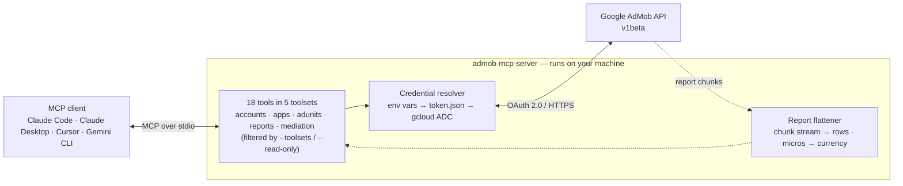
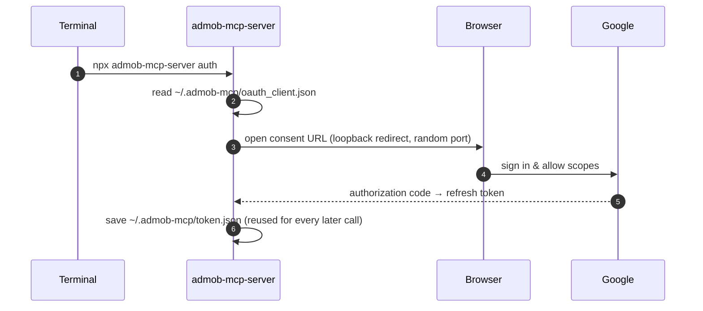

# AdMob MCP Server

[](https://www.npmjs.com/package/admob-mcp-server)
[](https://github.com/ParkSangGwon/admob-mcp-server/actions/workflows/ci.yml)
[](LICENSE)

**English** | [한국어](README.ko.md)

Ask your AI assistant about your AdMob apps and earnings — in plain language:

> - "How much did my apps earn in the last 7 days, broken down by country?"
> - "Which mediation ad source had the best eCPM this month?"
> - "Compare the RPM of my banner vs. rewarded ad units."
> - "Create a rewarded ad unit for my new game."


This is a [Model Context Protocol (MCP)](https://modelcontextprotocol.io) server for the [Google AdMob API](https://developers.google.com/admob/api).\
It works with Claude Code, Claude Desktop, Cursor, Gemini CLI, and any other MCP-capable AI client.

## Architecture



Credentials and revenue data travel only between your machine and Google — there is no third-party server in between.

## Features

- **Full AdMob API v1beta coverage** — 18 tools across accounts, apps, ad units, reports, and mediation, including write operations the v1 API doesn't have
- **Reports made readable** — streaming report responses are flattened into simple row tables, and monetary values (micros) are converted to real currency units
- **Read-only mode when you want it** — pass `--read-only` to hide all write tools (create/update) and issue tokens that can't modify anything
- **Toolsets** — enable only the tool groups you need, e.g. `--toolsets reports,accounts`
- **Three authentication options** — one-command browser sign-in (`npx admob-mcp-server auth`), environment-variable refresh token, or gcloud Application Default Credentials
- **Built-in analysis prompts** and report-spec reference resources

## Setup at a glance

One-time setup, roughly 10 minutes:

| Step                                                         | What you do                                                       | Where    |
| ------------------------------------------------------------ | ----------------------------------------------------------------- | -------- |
| [1. Google Cloud setup](#part-1--google-cloud-setup)         | Register a personal "app" so Google lets you access your own data | browser  |
| [2. Sign in](#part-2--sign-in)                               | Run one command and log in with Google                            | terminal |
| [3. Connect your AI client](#part-3--connect-your-ai-client) | Add one config entry and restart the client                       | terminal |

### Requirements

- **Node.js 18 or newer** — check with `node --version`; if missing, install from [nodejs.org](https://nodejs.org)
- An [AdMob](https://admob.google.com) account and the Google account that owns it

## Setup

### Part 1 — Google Cloud setup

Why is this needed?\
The AdMob API has no simple API keys — Google requires every program that accesses your data to be registered as an "OAuth app".\
Here you register a personal one that only you will use.\
It's free and needs no billing setup.

1. **Create (or select) a Google Cloud project**: [console.cloud.google.com/projectcreate](https://console.cloud.google.com/projectcreate) — any name works; reusing an existing project is fine too.
2. **Enable the AdMob API**: [console.cloud.google.com/apis/library/admob.googleapis.com](https://console.cloud.google.com/apis/library/admob.googleapis.com) → check that your project is selected in the top bar → **Enable**.
3. **Configure the OAuth consent screen**: [console.cloud.google.com/auth/overview](https://console.cloud.google.com/auth/overview) — the first visit opens a short wizard:
   - App name: anything (e.g. `admob-mcp`), and your email as the support/contact email
   - Audience: **External**
   - Finish the wizard — you do **not** need to submit the app for Google's verification
   - Then go to **Audience → Test users → Add users** and add **the Google account that owns your AdMob account**
4. **Create an OAuth client**: [console.cloud.google.com/apis/credentials](https://console.cloud.google.com/apis/credentials) → **Create credentials → OAuth client ID**
   - Application type: **Desktop app**
   - After creating it, click **Download JSON** — you'll use this file in Part 2

> [!WARNING]
> While the consent screen is in **Testing** mode, Google expires sign-ins after **7 days**, so you'll need to re-run the sign-in weekly.\
> To stop that, publish the app (**Audience → Publish app**).\
> Publishing for your own use doesn't require Google's verification — you'll just see an "unverified app" warning during sign-in, which is expected.

### Part 2 — Sign in

Move the JSON file you downloaded to where the server looks for it, then run the sign-in command:

```bash
mkdir -p ~/.admob-mcp
mv ~/Downloads/client_secret_*.json ~/.admob-mcp/oauth_client.json

npx admob-mcp-server auth
```

(On Windows, move the file to `C:\Users\<you>\.admob-mcp\oauth_client.json` in Explorer, then run the `npx` command.)

Your browser opens.\
Pick **the Google account that owns your AdMob account** and allow access.\
If you see a **"Google hasn't verified this app"** warning, that's your own app from Part 1 — click "Continue".\
When the terminal prints `Setup complete`, your sign-in is saved to `~/.admob-mcp/token.json` and reused from then on.

By default the sign-in covers every tool, including write tools.\
If you only want reporting access, run `npx admob-mcp-server auth --read-only` instead.

What the `auth` command does:



<details>
<summary><b>Advanced: environment variables (headless / CI)</b></summary>

If you already have a refresh token, no files are needed (write tools additionally need the token to cover the `admob.monetization` scope):

```bash
export GOOGLE_CLIENT_ID="....apps.googleusercontent.com"
export GOOGLE_CLIENT_SECRET="..."
export GOOGLE_REFRESH_TOKEN="..."
```

</details>

<details>
<summary><b>Advanced: gcloud Application Default Credentials</b></summary>

The same pattern Google's official Analytics/Ads MCP servers use:

```bash
gcloud auth application-default login \
  --scopes=https://www.googleapis.com/auth/admob.readonly,https://www.googleapis.com/auth/admob.report,https://www.googleapis.com/auth/admob.monetization,https://www.googleapis.com/auth/cloud-platform \
  --client-id-file=path/to/oauth_client.json
```

Drop the `admob.monetization` scope if you only want reporting access.

</details>

Credential resolution order: **environment variables → `token.json` (from `auth`) → ADC**.

### Part 3 — Connect your AI client

Pick your client below.\
MCP servers are loaded when the client starts, so **restart the client** after adding the config.

**Claude Code**

```bash
claude mcp add admob -- npx -y admob-mcp-server
```

Verify with `claude mcp list` — you should see `admob: ... - ✔ Connected`.

**Claude Desktop** — open **Settings → Developer → Edit Config**, which opens `claude_desktop_config.json` (macOS: `~/Library/Application Support/Claude/`, Windows: `%APPDATA%\Claude\`), and add:

```json
{
  "mcpServers": {
    "admob": {
      "command": "npx",
      "args": ["-y", "admob-mcp-server"]
    }
  }
}
```

Restart the app; the admob tools appear in the tools menu of the chat input.

**Cursor** — add the same `mcpServers` block to `~/.cursor/mcp.json`, then check **Settings → MCP** shows admob as enabled.

**Gemini CLI** — add the same `mcpServers` block to `~/.gemini/settings.json`, then check with `/mcp` inside the CLI.

> [!TIP]
> If you used the environment-variable sign-in, pass the variables through your client's `env` block (Claude Code: repeat `--env KEY=value` before `--`; JSON configs: add an `"env": { ... }` object next to `"args"`).

## Try it

You don't call tools yourself — just ask in plain language and the assistant picks the right tools.\
Some starters:

- _"What did my apps earn last week?"_
- _"Break down this month's revenue by country and app."_
- _"Which ad format had the highest RPM in the last 30 days?"_
- _"How is my mediation doing? Compare ad sources by observed eCPM."_
- _"List my apps and their ad units."_
- _"Create a rewarded ad unit named 'shop_reward' for my game app."_

Most clients ask for your permission before each tool call, so nothing (especially write operations) runs without your approval.

## Configuration

All configuration is optional — the defaults work for a single AdMob account.

### Environment variables

| Variable                  | Description                                                                                     | Default                               |
| ------------------------- | ----------------------------------------------------------------------------------------------- | ------------------------------------- |
| `ADMOB_ACCOUNT`           | Publisher ID (`pub-XXXXXXXXXXXXXXXX`). Only needed when your login can access multiple accounts | auto-discovered                       |
| `ADMOB_TOOLSETS`          | Comma-separated toolsets to enable                                                              | all                                   |
| `ADMOB_READ_ONLY`         | `true` to skip write tools                                                                      | `false`                               |
| `ADMOB_CREDENTIALS_DIR`   | Directory for `oauth_client.json` / `token.json`                                                | `~/.admob-mcp`                        |
| `ADMOB_OAUTH_CLIENT_FILE` | Path to the OAuth client JSON used by `auth`                                                    | `<credentials dir>/oauth_client.json` |
| `GOOGLE_CLIENT_ID`        | OAuth client ID (env sign-in; also used by `auth` instead of the JSON file)                     | —                                     |
| `GOOGLE_CLIENT_SECRET`    | OAuth client secret (env sign-in)                                                               | —                                     |
| `GOOGLE_REFRESH_TOKEN`    | OAuth refresh token (env sign-in)                                                               | —                                     |

### CLI flags

| Flag                   | Description                                              |
| ---------------------- | -------------------------------------------------------- |
| `--toolsets <names>`   | Same as `ADMOB_TOOLSETS`, e.g. `--toolsets reports,apps` |
| `--read-only`          | Same as `ADMOB_READ_ONLY=true`                           |
| `--account <pub-id>`   | Same as `ADMOB_ACCOUNT`                                  |
| `--client-file <path>` | Same as `ADMOB_OAUTH_CLIENT_FILE` (for `auth`)           |

CLI flags take precedence over environment variables.\
Flags go after the command in your client config, e.g. `npx -y admob-mcp-server --read-only`.

## Tools

A "tool" is a function the AI assistant can call on your behalf.\
Tools are grouped into five toolsets; all are enabled by default, and `--read-only` skips the write tools:

| Toolset     | Read tools                                                                           | Write tools (skipped with `--read-only`)                                                                                                       |
| ----------- | ------------------------------------------------------------------------------------ | ---------------------------------------------------------------------------------------------------------------------------------------------- |
| `accounts`  | `list_accounts`, `get_account`                                                       | —                                                                                                                                              |
| `apps`      | `list_apps`                                                                          | `create_app`                                                                                                                                   |
| `adunits`   | `list_ad_units`                                                                      | `create_ad_unit`                                                                                                                               |
| `reports`   | `generate_network_report`, `generate_mediation_report`, `generate_campaign_report`   | —                                                                                                                                              |
| `mediation` | `list_ad_sources`, `list_adapters`, `list_mediation_groups`, `list_ad_unit_mappings` | `create_mediation_group`, `update_mediation_group`, `create_ad_unit_mapping`, `create_mediation_ab_experiment`, `stop_mediation_ab_experiment` |

Read tools require the `admob.readonly` / `admob.report` scopes; write tools require `admob.monetization` (requested by default during `auth`).

### accounts

| Tool            | Description                                                                |
| --------------- | -------------------------------------------------------------------------- |
| `list_accounts` | List accessible publisher accounts — use to find your `pub-...` ID         |
| `get_account`   | Get account details: publisher ID, reporting currency, reporting time zone |

### apps

| Tool         | Description                                                                                   |
| ------------ | --------------------------------------------------------------------------------------------- |
| `list_apps`  | List registered apps with app ID, platform, store link, and approval state                    |
| `create_app` | Create an app — link a store listing via `appStoreId`, or register manually via `displayName` |

### adunits

| Tool             | Description                                                                                   |
| ---------------- | --------------------------------------------------------------------------------------------- |
| `list_ad_units`  | List ad units with their IDs, formats, and owning apps                                        |
| `create_ad_unit` | Create an ad unit (`appId`, `displayName`, `adFormat`, optional `adTypes` / `rewardSettings`) |

### reports

All report tools take `startDate` / `endDate` (`YYYY-MM-DD`), `metrics`, and optional `dimensions`, `dimensionFilters`, `sortConditions`, `maxReportRows` (default 1000), `currencyCode`.\
Responses are flat tables; monetary metrics are converted from micros to currency units.

| Tool                        | Description                                                                                          |
| --------------------------- | ---------------------------------------------------------------------------------------------------- |
| `generate_network_report`   | AdMob Network performance: earnings, impressions, clicks, match rate, RPM, ...                       |
| `generate_mediation_report` | Mediation performance across ad sources: earnings, observed eCPM per `AD_SOURCE` / `MEDIATION_GROUP` |
| `generate_campaign_report`  | Cross-promotion campaign stats (last 30 days only): impressions, clicks, installs, cost              |

Valid dimensions/metrics per report are exposed as MCP resources (reference documents the assistant can read): `admob://reference/network-report-spec`, `mediation-report-spec`, `campaign-report-spec`.

### mediation

| Tool                             | Description                                                        |
| -------------------------------- | ------------------------------------------------------------------ |
| `list_ad_sources`                | List available mediation ad sources (ad networks) and their IDs    |
| `list_adapters`                  | List adapters of an ad source, incl. required configuration keys   |
| `list_mediation_groups`          | List mediation groups with targeting and lines (supports `filter`) |
| `list_ad_unit_mappings`          | List third-party placements mapped to an ad unit                   |
| `create_ad_unit_mapping`         | Map an ad unit to a third-party placement via an adapter           |
| `create_mediation_group`         | Create a mediation group (targeting + mediation lines)             |
| `update_mediation_group`         | Patch a mediation group using an `updateMask`                      |
| `create_mediation_ab_experiment` | Start an A/B experiment on a mediation group                       |
| `stop_mediation_ab_experiment`   | Stop the experiment, choosing the winning variant                  |

## Prompts

Prompts are ready-made analysis requests.\
Your client surfaces them as slash commands or a prompt picker (e.g. `/top_performing_apps` in Claude Code).\
All take an optional `days` argument:

| Prompt                | What it does                                               |
| --------------------- | ---------------------------------------------------------- |
| `top_performing_apps` | Ranks your apps by revenue with RPM and match-rate context |
| `revenue_summary`     | Daily revenue trend with anomaly call-outs                 |
| `compare_ad_formats`  | Compares earnings and efficiency across ad formats         |

## Security & privacy

- The server runs entirely on your computer.\
  Your data flows only between your machine and Google's API — never through any third-party server.
- Two files are stored locally, both readable only by your user account: `~/.admob-mcp/oauth_client.json` (your OAuth app) and `~/.admob-mcp/token.json` (your sign-in).
- **To sign out**: delete `~/.admob-mcp/token.json`, and optionally revoke the app's access at [myaccount.google.com/permissions](https://myaccount.google.com/permissions).
- Worried about accidental changes?\
  Run with `--read-only` — write tools disappear entirely and the sign-in only requests read scopes.

## Troubleshooting

### Install & connection

#### `command not found: npx` / `spawn npx ENOENT`

- **Cause**: Node.js is not installed, or your client can't find it.
- **Fix**: install Node 18+ from [nodejs.org](https://nodejs.org), then restart the client.

#### The server doesn't appear in the client

- **Cause**: MCP servers load at client startup, or the server fails to start.
- **Fix**: restart the client first.\
  Then check its MCP status (Claude Code: `claude mcp list`, Gemini CLI: `/mcp`), and make sure `npx -y admob-mcp-server` runs in a terminal without errors.

### Sign-in & auth

#### "No usable Google credentials found"

- **Cause**: sign-in hasn't been set up yet.
- **Fix**: follow [Part 2 — Sign in](#part-2--sign-in).

#### `invalid_grant` / "token has been expired or revoked"

- **Cause**: your sign-in expired.\
  With a consent screen in **Testing** mode this happens every 7 days.
- **Fix**: re-run `npx admob-mcp-server auth`.\
  To stop it recurring, publish the app (**Audience → Publish app**).

#### `access_denied` during browser sign-in

- **Cause**: the Google account you picked is not a test user of the consent screen.
- **Fix**: add it under **Audience → Test users**, or publish the app.

#### "The publisher could not be authenticated"

- **Cause**: the Google account you signed in with has no active AdMob account.
- **Fix**: re-run `npx admob-mcp-server auth` and pick the account that owns your AdMob account in the account chooser.

### API errors

#### 403 `PERMISSION_DENIED`

- **Cause**: the AdMob API isn't enabled, the wrong Google account is signed in, or the write scope is missing.
- **Fix**: check the following:
  1. The [AdMob API is enabled](https://console.cloud.google.com/apis/library/admob.googleapis.com) in the same project as your OAuth client
  2. You signed in with the account that owns the AdMob account
  3. For write tools, your token covers `admob.monetization` — tokens from `auth --read-only` can't write; re-run `npx admob-mcp-server auth`

#### 429 `RESOURCE_EXHAUSTED`

- **Cause**: AdMob API quota hit ([usage limits](https://developers.google.com/admob/api/limits)).
- **Fix**: retry later, or reduce the request — narrower date range, fewer dimensions.

#### "Multiple AdMob accounts found"

- **Cause**: your Google login can access several publisher accounts.
- **Fix**: set `ADMOB_ACCOUNT=pub-...` (find IDs with `list_accounts`).

## Development

```bash
git clone https://github.com/ParkSangGwon/admob-mcp-server.git
cd admob-mcp-server
npm install
npm test
npm run build

# debug with the MCP Inspector
npm run inspect
```

To run a local build in a client, point it at the built entry instead of npx: `node /path/to/admob-mcp-server/dist/index.js`.

Releases: pushing a `v*` tag runs CI and publishes to npm with provenance (see `.github/workflows/release.yml`).

## Contributing

Issues and pull requests are welcome.\
For larger changes, please open an issue first to discuss the direction.\
Make sure `npm run lint`, `npm run format:check`, and `npm test` pass.

## License

[MIT](LICENSE)
